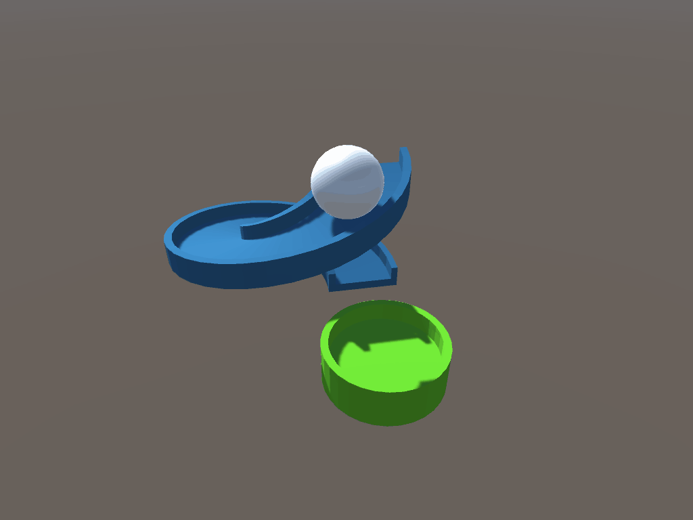

> ## View the entire tutorial on [GameDev Resources](https://gamedev-resources.com/getting-started-with-unity/).

# Getting started with Unity

## In this tutorial, you’ll learn about scenes, GameObjects, asset workflow, physics and more.

> You’ll need Unity 2019.3.6f1 (or newer) to follow along. This tutorial assumes knowledge of C#.

Making games is a fun, rewarding and humbling experience. While learning how can be very overwhelming, rest assured - it’s well worth the time! It’s very difficult to describe the feeling of seeing the look of pure joy on someone's face as they play your game for the first time. But you will know the feeling soon enough!

At the end of this tutorial you will have a game scene that has a ball roll down a ramp and into a bucket. Once it lands in the bucket, the screen will display text.

## Learning Outcomes 

My goal with this tutorial is to give you the core concepts needed to get started on your own masterpiece by learning the following topics:

- Creating and structuring new projects.
- Navigating the user interface.
- What assets are and how to import them.
- Scene setup including the camera, GameObjects and more.
- Brief introduction of the physics engine.
- How to add text to the in-game UI

## Prerequisites

1. Knowledge of C#.
2. The [Unity Hub](https://unity3d.com/get-unity/download) and Unity Editor should be installed.

## Resources

1. [MonoBehavior API](https://docs.unity3d.com/ScriptReference/MonoBehaviour.html)
2. [Physics - Manual Reference](https://docs.unity3d.com/Manual/PhysicsSection.html)
3. [Collider - Manual Reference](https://docs.unity3d.com/Manual/CollidersOverview.html)
4. [Collider API](https://docs.unity3d.com/ScriptReference/Collider.html)